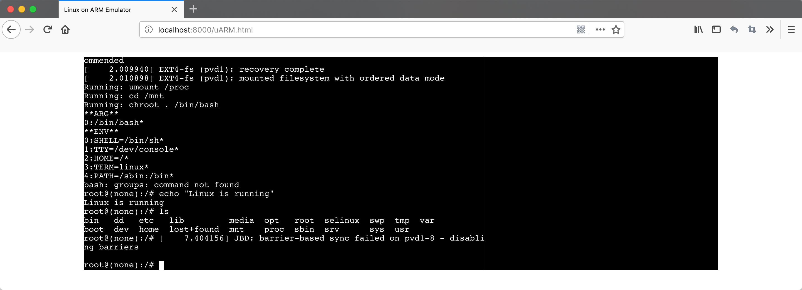

# What's this?
This is simple ARM emulator called uARM, implemented by Dmitry Grinberg ([Website](http://dmitry.gr/index.php?r=05.Projects&proj=07.%20Linux%20on%208bit)).

Now it has been ported to run in browsers with WebAssembly.

# Screenshot


# How to compile it myself?

## Get codes

```
$ git clone https://github.com/TonyLianLong/uARM.wasm
```

## Install Emscripten (emcc)
See this: https://github.com/kripken/emscripten/wiki

## Uncompress image

```
$ bzcat jaunty.rel.v2.bz2 > jaunty.rel.v2
```

## Compile

```
$ make
```

You will get uARM.html, uARM.data, and so on.


## Boot linux up.

Use the server.py provided and open http://localhost:8000/uARM.html in a modern browser that supports WebAssembly (Firefox 63.0 and Chrome 69.0 works).
